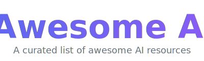

   
  
   
   

## Awesome AI 

> A curated list of awesome AI tools, frameworks, plugins, and resources.

<!-- START doctoc generated TOC please keep comment here to allow auto update -->
<!-- DON'T EDIT THIS SECTION, INSTEAD RE-RUN doctoc TO UPDATE -->

- [Resources](#resources)
  - [Official Resources](#official-resources)
- [AI Coding Agents](#ai-coding-agents)
- [AI Development & Observability](#ai-development--observability)
- [AI Model Training & Fine-Tuning](#ai-model-training--fine-tuning)
- [AI Infrastructure](#ai-infrastructure)
- [AI-Powered Content Creation](#ai-powered-content-creation)

<!-- END doctoc generated TOC please keep comment here to allow auto update -->

## Resources

### Official Resources

- [Anthropic](https://www.anthropic.com/) - AI safety company and creator of Claude
- [Google DeepMind](https://deepmind.google/) - Google's AI research lab
- [OpenAI](https://openai.com/) - AI research and deployment company

## AI Coding Agents

- [Claude Code](https://github.com/anthropics/claude-code) - Anthropic's agentic coding tool that lives in your terminal, understands your codebase, and helps you code faster through natural language
- [Jules](https://jules.google.com) - Google's autonomous AI coding agent powered by Gemini 2.5 Pro that integrates with GitHub to fix bugs, write tests, and submit PRs
- [OpenHands](https://github.com/All-Hands-AI/OpenHands) - Open-source AI software engineering platform where autonomous agents write code, run commands, and browse the web, with native GitHub/GitLab/Slack integrations
- [Tembo](https://www.tembo.io) - Autonomous coding agent platform that automates development tasks like shipping code, reviewing PRs, and fixing bugs across Slack, Linear, and GitHub
- [Claude Duet](https://github.com/EliranG/claude-duet) - Real-time pair programming tool that lets two developers share a Claude Code session with end-to-end encryption for collaborative AI-assisted development

## AI Development & Observability

- [Langfuse](https://langfuse.com) - Open-source LLM engineering platform providing tracing, evaluations, prompt management, and metrics to debug and improve LLM applications
- [Understand Anything](https://github.com/Lum1104/Understand-Anything) - Plugin that turns any codebase into an interactive knowledge graph you can explore, search, and query via a visual dashboard

## AI Model Training & Fine-Tuning

- [Unsloth](https://github.com/unslothai/unsloth) - Unified platform to run and fine-tune AI models (text, audio, vision, embeddings) locally with a web-based Studio UI and code-based Core library

## AI Infrastructure

- [Steel](https://steel.dev) - Cloud browser infrastructure for AI agents providing isolated browser sessions with built-in anti-bot stealth and CAPTCHA-solving capabilities

## AI-Powered Content Creation

- [Remotion](https://remotion.dev) - React framework that lets developers create real MP4 videos programmatically by writing React components instead of using traditional video editing software

---

## Contributing

Contributions welcome! Read the [contribution guidelines](CONTRIBUTING.md) first.

## License

