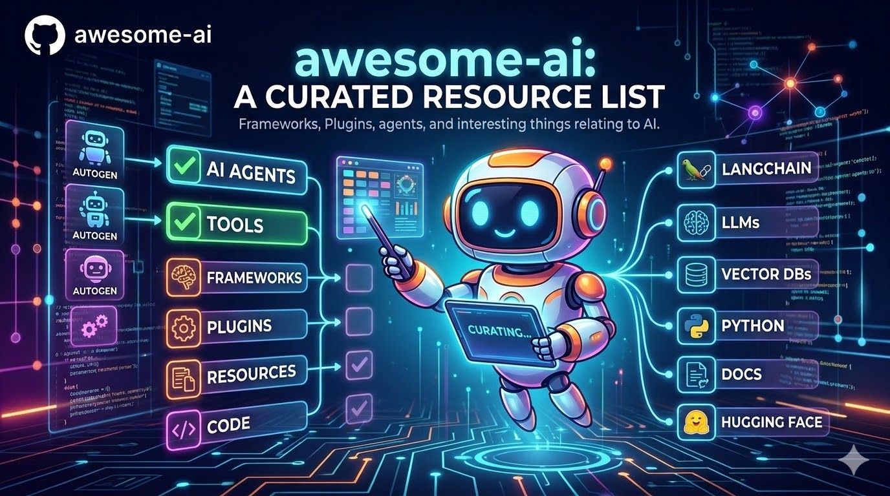

   
  
   
   

## Awesome AI 

> A curated list of awesome AI tools, frameworks, plugins, and resources.

<!-- START doctoc generated TOC please keep comment here to allow auto update -->
<!-- DON'T EDIT THIS SECTION, INSTEAD RE-RUN doctoc TO UPDATE -->

- [Resources](#resources)
  - [Official Resources](#official-resources)
- [AI Coding](#ai-coding)
  - [Cloud Autonomous Coding Agents](#cloud-autonomous-coding-agents)
  - [Local Coding Agents & Assistants](#local-coding-agents--assistants)
  - [AI Code Editors](#ai-code-editors)
  - [Collaborative AI Coding](#collaborative-ai-coding)
- [AI Development & Observability](#ai-development--observability)
- [AI Model Training & Fine-Tuning](#ai-model-training--fine-tuning)
- [AI Infrastructure](#ai-infrastructure)
  - [Browser Infrastructure](#browser-infrastructure)
- [AI-Powered Content Creation](#ai-powered-content-creation)
  - [Video](#video)
- [Knowledge & Understanding](#knowledge--understanding)

<!-- END doctoc generated TOC please keep comment here to allow auto update -->

---

## Resources

### Official Resources

- [Anthropic](https://www.anthropic.com/) - AI safety company and creator of Claude
- [Google DeepMind](https://deepmind.google/) - Google's AI research lab
- [OpenAI](https://openai.com/) - AI research and deployment company

## AI Coding

### Cloud Autonomous Coding Agents

> Agents that run **asynchronously in the cloud**. Unlike traditional code assistants that autocomplete while you type, these agents spin up a virtual machine (sandbox), clone your repo, install dependencies, analyze context, create an action plan, and write code autonomously — delivering results as pull requests. You assign a task and come back later.

- [Jules](https://jules.google.com) - Google's autonomous AI coding agent powered by Gemini 2.5 Pro that creates cloud sandboxes, plans multi-step fixes, and submits PRs directly to your GitHub repo
- [Devin](https://devin.ai) - Autonomous AI software engineer by Cognition Labs that plans, codes, debugs, and deploys in its own cloud sandbox with shell, editor, and browser
- [GitHub Copilot Coding Agent](https://github.com/features/copilot) - GitHub's asynchronous cloud-based coding agent that autonomously completes tasks in background dev environments, opening PRs with built-in security scanning
- [OpenHands](https://github.com/All-Hands-AI/OpenHands) - Open-source (MIT) AI software engineering platform where autonomous agents write code, run commands, and browse the web in sandboxed containers, with native GitHub/GitLab/Slack integrations
- [Tembo](https://www.tembo.io) - Autonomous coding agent platform that automates development tasks like shipping code, reviewing PRs, and fixing bugs across Slack, Linear, and GitHub

### Local Coding Agents & Assistants

> Agents that run **locally on your machine**, directly in your terminal or IDE. They have full access to your local filesystem, tools, and environment. You interact in real-time, iterating together — they read your code, run commands, edit files, and execute tasks while you stay in control.

- [Claude Code](https://github.com/anthropics/claude-code) - Anthropic's agentic coding tool that lives in your terminal, understands your codebase, and helps you code faster through natural language — edits files, runs commands, and handles git workflows locally

### AI Code Editors

> Full code editors (or editor forks) with **AI built into the core experience**. They go beyond plugins: the entire editing environment is designed around AI-powered code generation, multi-file editing, and codebase-aware chat. You write code alongside the AI in real-time.

- [Cursor](https://cursor.com) - AI-first code editor (VS Code fork) with codebase-aware chat, multi-file editing, and multi-model support (GPT, Claude, Gemini)

### Collaborative AI Coding

> Tools focused on **multiplayer AI-assisted development**. Multiple developers share an AI coding session in real-time, enabling pair programming and team collaboration with AI as a shared teammate.

- [Claude Duet](https://github.com/EliranG/claude-duet) - Real-time pair programming tool that lets two developers share a Claude Code session with end-to-end encryption for collaborative AI-assisted development

## AI Development & Observability

> Platforms for **monitoring, debugging, and improving LLM-powered applications**. They provide tracing, evaluations, prompt management, and usage metrics — the DevOps/observability layer for AI applications.

- [Langfuse](https://langfuse.com) - Open-source LLM engineering platform providing tracing, evaluations, prompt management, and metrics to debug and improve LLM applications

## AI Model Training & Fine-Tuning

> Tools for **training, fine-tuning, and running AI models locally**. Instead of relying solely on API calls to cloud providers, these platforms let you customize models on your own hardware, optimizing for your specific use case, data, and cost constraints.

- [Unsloth](https://github.com/unslothai/unsloth) - Unified platform to run and fine-tune AI models (text, audio, vision, embeddings) locally with a web-based Studio UI and code-based Core library

## AI Infrastructure

### Browser Infrastructure

> **Headless browser infrastructure purpose-built for AI agents**. These services provide isolated browser sessions in the cloud so that AI agents can navigate the web, interact with pages, and extract data — handling CAPTCHAs, anti-bot detection, and session management automatically.

- [Steel](https://steel.dev) - Cloud browser infrastructure for AI agents providing isolated browser sessions with built-in anti-bot stealth and CAPTCHA-solving capabilities

## AI-Powered Content Creation

### Video

> Frameworks that let developers **create video programmatically using code** instead of traditional video editing software. Write components or scripts, and the framework renders real MP4/WebM videos — perfect for data-driven, templated, or AI-generated video content.

- [Remotion](https://remotion.dev) - React framework that lets developers create real MP4 videos programmatically by writing React components instead of using traditional video editing software

## Knowledge & Understanding

> Tools that **transform codebases and documents into navigable knowledge structures**. They analyze relationships, dependencies, and semantics to produce interactive graphs, visual dashboards, and queryable representations — helping you understand complex systems at a glance.

- [Understand Anything](https://github.com/Lum1104/Understand-Anything) - Plugin that turns any codebase into an interactive knowledge graph you can explore, search, and query via a visual dashboard

---

## Contributing

Contributions welcome! Read the [contribution guidelines](CONTRIBUTING.md) first.

## License

